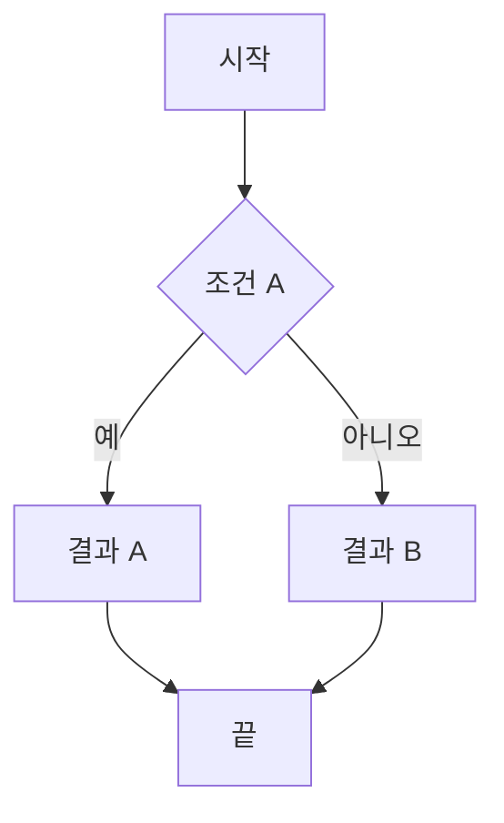
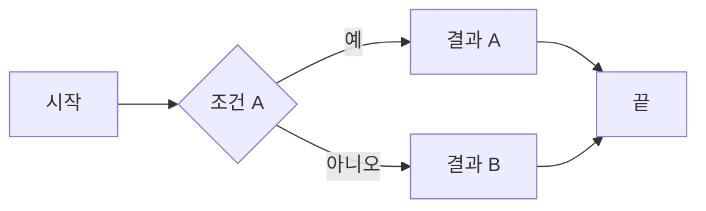
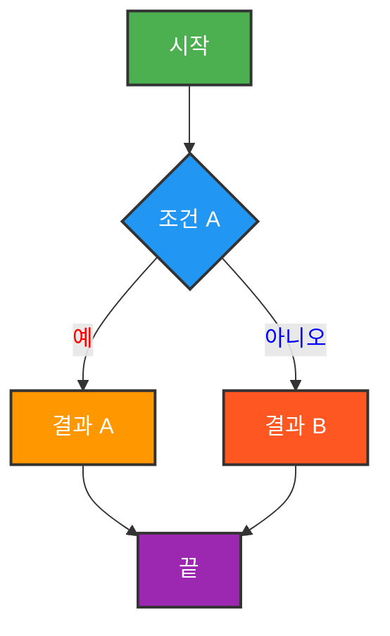
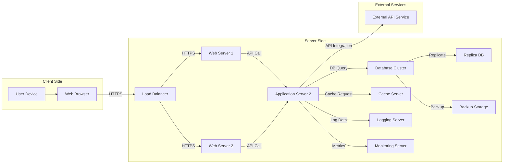
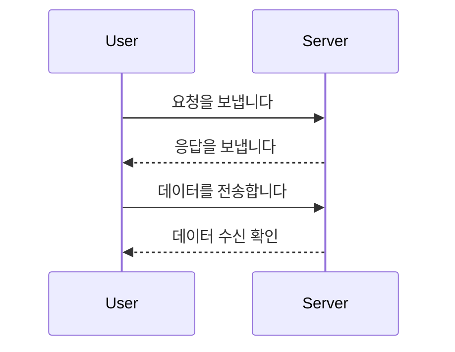

## 목차
{: .no_toc .text-delta }

1. TOC
{:toc}

---

# 📊 Mermaid 다이어그램 사용 예제

Mermaid는 마크다운에서 다이어그램을 쉽게 작성할 수 있도록 도와주는 강력한 도구입니다. Jekyll 블로그에서 시스템 아키텍처, 플로우차트, 시퀀스 다이어그램 등을 표현할 때 유용합니다.

## 기본 플로우차트

다음은 Mermaid를 사용하여 만든 기본적인 플로우차트입니다. `graph TD`를 사용하여 상단에서 하단으로 흐르는 다이어그램을 생성할 수 있습니다:

## 다이어그램 방향 설정

Mermaid 다이어그램은 다양한 방향 설정을 지원합니다:

- **Top to Down (TD)**: 노드들이 위에서 아래로 배치됩니다.
- **Left to Right (LR)**: 노드들이 왼쪽에서 오른쪽으로 배치됩니다.
- **Bottom to Top (BT)**: 노드들이 아래에서 위로 배치됩니다.
- **Right to Left (RL)**: 노드들이 오른쪽에서 왼쪽으로 배치됩니다.

### 예시: Left to Right (LR)

## 색상 설정 가능

## 복잡한 시스템 아키텍처

복잡한 시스템 아키텍처나 서버 구성 요소를 표현할 때도 Mermaid를 활용할 수 있습니다. 아래는 서버 구성 요소들을 시각화한 예시입니다

## Sequence Diagram (시퀀스 다이어그램)

