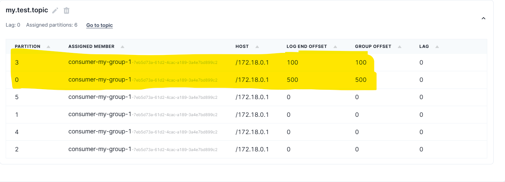
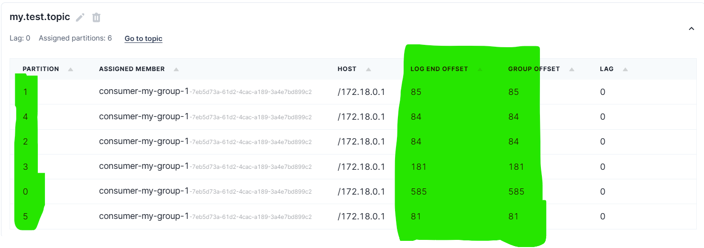

## 목차
{: .no_toc .text-delta }

1. TOC
{:toc}

---
# Kafka 프로듀서 옵션 실험

Kafka 프로듀서의 주요 옵션들을 정리하고,  
각 옵션이 메시지 전송 방식에 어떤 영향을 주는지 실험을 통해 확인한다.

# 프로듀서 옵션

Kafka 프로듀서에서 자주 사용하는 주요 옵션들을 정리한다.

| 옵션명 | 설명 | 기본값 |
|--------|------|--------|
| `acks` | 메시지를 전송한 후, 브로커로부터 어떤 수준의 응답을 받을지 설정한다. `0`, `1`, `all` 값 사용 가능. | `1` |
| `retries` | 메시지 전송 실패 시 재시도 횟수 | `2147483647` |
| `batch.size` | 하나의 배치에 담길 수 있는 최대 바이트 수 | `16384` (16KB) |
| `linger.ms` | 배치를 기다리는 최대 시간(ms). 이 시간 안에 batch가 꽉 차지 않아도 전송함 | `0` |
| `compression.type` | 전송 시 사용할 압축 방식. `none`, `gzip`, `snappy`, `lz4`, `zstd` 중 선택 | `none` |
| `enable.idempotence` | 메시지 중복 방지를 위한 옵션. 정확히 한 번만 전송을 보장 | `false` |
| `max.in.flight.requests.per.connection` | 하나의 커넥션에서 동시에 보낼 수 있는 요청 수 | `5` |
| `buffer.memory` | 프로듀서가 사용할 수 있는 메모리 총량 (바이트) | `33554432` (32MB) |

---

## 실험 환경

- Kafka 브로커는 총 3대로 클러스터를 구성하였다.
- 각 브로커는 동일한 설정으로 Docker Compose를 이용해 실행되며, 기본적인 Replication과 Partition 설정은 Kafka의 기본값을 따른다.
- 
- 관찰을 위해 [Redpanda Console](https://redpanda.com/console/)을 사용했다.

## 기본 실험

Kafka 프로듀서의 기본 설정 상태에서 메시지를 전송했을 때  
메시지들이 파티션에 어떻게 분배되는지 확인한다.

### 테스트 코드
```java
@Configuration
public class KafkaProducerConfig {
    private final String BOOTSTRAP_SERVER = "localhost:9092,localhost:9093,localhost:9094";

    @Bean
    public ProducerFactory<String, String> producerFactory() {
        Map<String, Object> config = new HashMap<>();
        config.put(ProducerConfig.BOOTSTRAP_SERVERS_CONFIG, BOOTSTRAP_SERVER);
        config.put(ProducerConfig.KEY_SERIALIZER_CLASS_CONFIG, StringSerializer.class);
        config.put(ProducerConfig.VALUE_SERIALIZER_CLASS_CONFIG, StringSerializer.class);
        return new DefaultKafkaProducerFactory<>(config);
    }
}
```

```java
private final String TOPIC_NAME = "my.test.topic";

@Test
void 토픽메시지500번넣기() {
    long start = System.currentTimeMillis();
    for (int i = 1; i <= 500; i++) {
        kafkaTemplate.send(TOPIC_NAME, "data insert - " + i);
    }
    long end = System.currentTimeMillis();
    System.out.println("총 소요 시간: " + (end - start) + "ms");
}
```

### 결과

- 총 소요 시간: 139ms

3번 파티션에 100개 (처음에 100개로 사전 테스트)  
0번 파티션에 500개의 메시지가 들어간 것을 확인할 수 있다.

메시지들이 특정 파티션으로만 전송되는 이유는  
Kafka 프로듀서가 기본적으로 **`sticky partitioner`** 방식을 사용하기 때문이다.

- 메시지를 배치로 전송할 때 하나의 파티션을 선택하고,  
  해당 배치가 전송되기 전까지는 계속 그 파티션으로만 보낸다.
- 이후 배치가 전송되고 나면, 다음 배치부터는 다른 파티션으로 변경될 수 있다.

---

## 📦 batch.size와 linger.ms 실험

### 소스코드

```java
@Bean
public ProducerFactory<String, String> producerFactory() {
    Map<String, Object> config = new HashMap<>();
    config.put(ProducerConfig.BOOTSTRAP_SERVERS_CONFIG, BOOTSTRAP_SERVER);
    config.put(ProducerConfig.KEY_SERIALIZER_CLASS_CONFIG, StringSerializer.class);
    config.put(ProducerConfig.VALUE_SERIALIZER_CLASS_CONFIG, StringSerializer.class);
    config.put(ProducerConfig.BATCH_SIZE_CONFIG, 1);
    config.put(ProducerConfig.LINGER_MS_CONFIG, 0);
    return new DefaultKafkaProducerFactory<>(config);
}
```

- `BATCH_SIZE_CONFIG`, `LINGER_MS_CONFIG` 옵션을 최소값으로 설정하였다.
- 사실상 배치 기능을 껐다고 볼 수 있다.

### 결과



- 총 소요 시간: `123ms`
- 그런데... 전송 시간은 이전과 크게 차이 나지 않았다.

500개의 메시지들이 6개의 파티션에 고르게 분산된 것을 확인할 수 있다.

### 분석

batch.size와 linger.ms를 최소로 설정하면,  
메시지들이 거의 개별적으로 전송되기 때문에 sticky partitioner 의미가 사라진다.

그래서 라운드로빈처럼 여러 파티션으로 분산되는 패턴을 보인 듯하다.

전송속도 부분에서는, 전송은 소켓을 매번 새로 여는 게 아니고  
한번 열린 후 계속 재사용하는 듯이 보인다.

---

## 🌻enable.idempotence 실험

Kafka 프로듀서의 enable.idempotence 옵션은
네트워크 오류나 브로커 장애 등으로 인해 재시도가 발생했을 때,
중복된 메시지가 Kafka에 기록되지 않도록 보장해주는 기능이다.
즉, 정상적인 상황에서는 아무런 효과가 없으며,
예외 상황에서 "정확히 한 번 전송"을 보장하기 위한 옵션이다.

| 옵션값 | 설명 |
|--------|------|
| `false` (기본값) | 전송 실패 시 재시도하면 중복 메시지가 들어갈 수 있다. |
| `true` | Kafka가 전송 순서와 중복 방지를 관리한다. 정확히 한 번 전송됨. |

---

### 실험 시나리오

- Kafka 클러스터 (3대)를 구성한 상태에서
- 브로커를 계속 죽였다 살렸다 반복하며 네트워크 장애 상황을 흉내냄
- 프로듀서는 `enable.idempotence` 값을 true / false 로 각각 설정하여 메시지를 전송
- 컨슈머 측에서 수신된 메시지를 중복 여부로 분석

---

### Kafka 브로커 학대 자동화 루프 배치파일

```
@echo off
:loop

echo Restarting kafka1...
docker stop kafka1
timeout /t 3 > nul
docker start kafka1
timeout /t 3 > nul

echo Restarting kafka2...
docker stop kafka2
timeout /t 3 > nul
docker start kafka2
timeout /t 3 > nul

echo Restarting kafka3...
docker stop kafka3
timeout /t 3 > nul
docker start kafka3
timeout /t 3 > nul

echo === One cycle done! ===
timeout /t 5 > nul
goto loop
```

---

### 프로듀서 설정

```
@Bean
public ProducerFactory<String, String> producerFactory() {
    Map<String, Object> config = new HashMap<>();
    config.put(ProducerConfig.BOOTSTRAP_SERVERS_CONFIG, BOOTSTRAP_SERVER);
    config.put(ProducerConfig.KEY_SERIALIZER_CLASS_CONFIG, StringSerializer.class);
    config.put(ProducerConfig.VALUE_SERIALIZER_CLASS_CONFIG, StringSerializer.class);
    config.put(ProducerConfig.ENABLE_IDEMPOTENCE_CONFIG, false); // true로도 테스트할 것
    return new DefaultKafkaProducerFactory<>(config);
}
```

---

### 메시지 전송 코드

```
@Test
void 토픽메시지10000번넣기() throws InterruptedException {
    long start = System.currentTimeMillis();
    for (int i = 1; i <= 10000; i++) {
        String s = UUID.randomUUID().toString();
        kafkaTemplate.send(TOPIC_NAME, "data insert - " + s + " : " + i);
        System.out.println("보내는 중 " + i);
        Thread.sleep(1); // 전송 간 텀
    }
    long end = System.currentTimeMillis();
    System.out.println("총 소요 시간: " + (end - start) + "ms");
}
```

---

### 결과

- `enable.idempotence = false`인 경우, 중복 메시지가 간헐적으로 발생했다.  
  실행할 때마다 수신 개수가 10006개, 10004개 등으로 달라졌다.
- `enable.idempotence = true`인 경우, 중복 없이 정확히 10000개의 메시지가 수신되었다.  
  여러 번 실행해도 결과는 동일했고, 중복 메시지는 검출되지 않았다.

